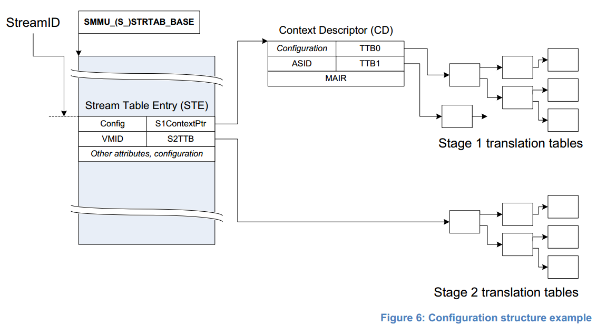
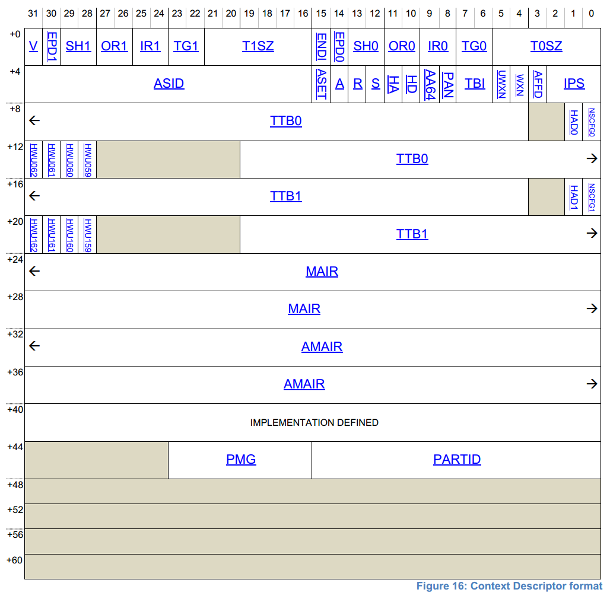

### SMMUv3总体框图


```
/* An SMMUv3 instance */
struct arm_smmu_device {
    struct device               *dev;
    void __iomem                *base;                         // SMMU 寄存器基地址

#define ARM_SMMU_FEAT_2_LVL_STRTAB      (1 << 0)
#define ARM_SMMU_FEAT_2_LVL_CDTAB       (1 << 1)
#define ARM_SMMU_FEAT_TT_LE             (1 << 2)
#define ARM_SMMU_FEAT_TT_BE             (1 << 3)
#define ARM_SMMU_FEAT_PRI               (1 << 4)
#define ARM_SMMU_FEAT_ATS               (1 << 5)
#define ARM_SMMU_FEAT_SEV               (1 << 6)
#define ARM_SMMU_FEAT_MSI               (1 << 7)
#define ARM_SMMU_FEAT_COHERENCY         (1 << 8)
#define ARM_SMMU_FEAT_TRANS_S1          (1 << 9)
#define ARM_SMMU_FEAT_TRANS_S2          (1 << 10)
#define ARM_SMMU_FEAT_STALLS            (1 << 11)
#define ARM_SMMU_FEAT_HYP               (1 << 12)
#define ARM_SMMU_FEAT_STALL_FORCE       (1 << 13)
#define ARM_SMMU_FEAT_VAX               (1 << 14)
    u32                         features;

#define ARM_SMMU_OPT_SKIP_PREFETCH      (1 << 0)
#define ARM_SMMU_OPT_PAGE0_REGS_ONLY    (1 << 1)
    u32                         options;

    struct arm_smmu_cmdq        cmdq;
    struct arm_smmu_evtq        evtq;
    struct arm_smmu_priq        priq;

    int                         gerr_irq;
    int                         combined_irq;

    unsigned long               ias; /* IPA */            
    unsigned long               oas; /* PA */               // 输出物理地址(PA)的bits
    unsigned long               pgsize_bitmap;              // PAGE大小(64K/512M, 16K/32M, or 4K/2M/1G)

#define ARM_SMMU_MAX_ASIDS              (1 << 16)
    unsigned int                asid_bits;                  // 16 bits or 8 bits
    DECLARE_BITMAP(asid_map, ARM_SMMU_MAX_ASIDS);

#define ARM_SMMU_MAX_VMIDS              (1 << 16)
    unsigned int                vmid_bits;                  // 16 bits or 8 bits
    DECLARE_BITMAP(vmid_map, ARM_SMMU_MAX_VMIDS);

    unsigned int                ssid_bits;                  // Max bits of SubStreamID(bits[10 : 6] in reg SMMU_S_IDR1)
    unsigned int                sid_bits;                   // Max bits of StreamID(bits[5 : 0] in reg SMMU_S_IDR1)

    struct arm_smmu_strtab_cfg  strtab_cfg;                 // StreamTable的配置

    /* IOMMU core code handle */
    struct iommu_device         iommu;
};
```

```
struct arm_smmu_strtab_cfg {
    __le64                      *strtab;                    // dma_alloc_coherent返回的虚地址。linear模式，指向STE数组；2level模式为descriptor指针数组，数组元素指向每个Descriptor
    dma_addr_t                  strtab_dma;                 // strtab对应的物理地址
    struct arm_smmu_strtab_l1_desc    *l1_desc;             // level1 descriptor数组，以(sid >> STRTAB_SPLIT)为下标
    unsigned int                num_l1_ents;                // linear模式，表示最大STE个数；2-level模式，表示descriptor个数;

    u64                         strtab_base;                // 保存SMMU_STRTAB_BASE寄存器接受的值(默认Read-Allocate)
    u32                         strtab_base_cfg;            // SMMU_STRTAB_BASE_CFG对应的配置
};
```

### 查找STE有两种模式：
1. linear模式


根据streamID找到对应的STE


2. 2-level模式
分两级查找STE。
* 先根据streamID中的高几位，找到descriptor；
* 再根据streamID的低位在对应的descriptor中，找到STE。

Descriptor结构如下：
```
/* High-level stream table and context descriptor structures */
struct arm_smmu_strtab_l1_desc {
    u8                          span;                       // 固定值为9，即256个STE
    __le64                      *l2ptr;                     // 以sid为索引的指针数组，指向每个STE
    dma_addr_t                  l2ptr_dma;
};
```


### STE查找TTB

STE中同时包含了stage1和stage2的信息：
* 若没有虚拟机，则只有stage1的翻译过程（VA -> PA）。
* 若有虚拟机，则stage1先把VA -> IPA，stage2再把IPA -> PA。

#### stage 1
STE指向ContextDescriptor也可以有三种模式：
* 单个CD：S1ContextPtr指向一个ContextDescriptor；
* linear模式： S1ContextPtr指向一个ContextDescriptor数组，根据SubStreamID（pasid）来查找具体的ContextDescriptor；

* 2level模式：S1ContextPtr指向一个L1CD的描述符数组，根据SubStreamID的高几位来定位L1CD；L1CD中的L2Ptr指向CD的数组，根据SubStreamID的低位来索引；


ContextDescriptor格式：

* ASID：用来标志不同进程；
* TTB0,TTB1：指向地址转换表的基地址

#### stage 2
STE->S2TTB

#### 找到TTB以后的翻译过程类似下图


#### 完整过程如下:
